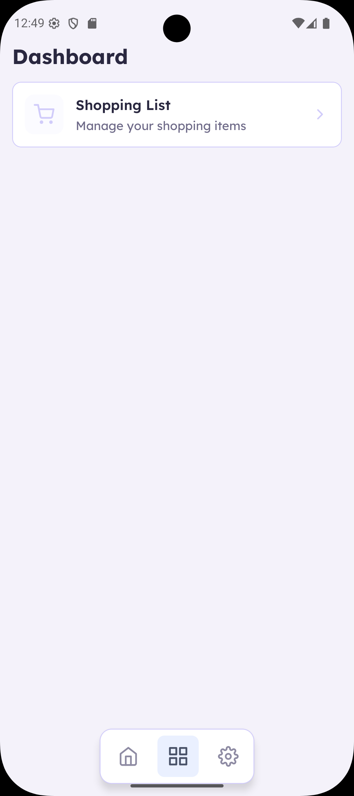
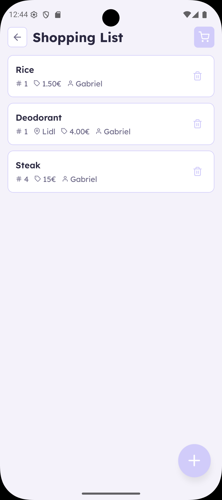
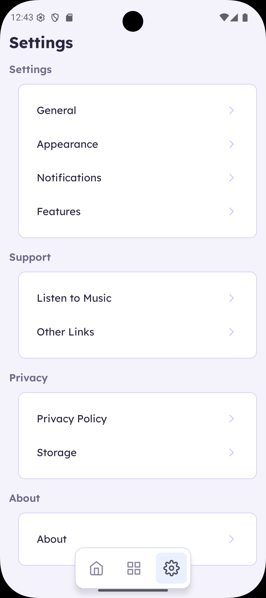

# Prodexa

	

Personal productivity management app to organize routines, tasks, your life in one place.

	

	
	
	
	

---

## Summary

[Overview](#overview) • [Download](#download) • [Tech Stack](#tech-stack) • [Screenshots](#screenshots) • [Features](#features) • [License](#license)

## Overview

**Prodexa** is a mobile app focused on personal productivity, designed to help with daily planning through a simple, fast, and modern experience.

## Download

- 🔗 Download the latest version from **[Releases](https://github.com/Nihhiu/Prodexa/releases)**

## Tech Stack

- React Native
- Expo
- NativeWind (Tailwind CSS)
- TypeScript

## Screenshots

| Dashboard | Shopping | Settings |
|-----------|----------|----------|
|  |  |  |

## Features

- ✅ Shopping management (shopping list)
- ❌ Wallet & expenses management
- ❌ Countdown
- ❌ Tasks
- ❌ Notes
- ❌ Habits
- ❌ Diary
- 🧩 Structure ready for many more productivity features

## License

This project is licensed under the terms defined in [LICENSE](LICENSE).

